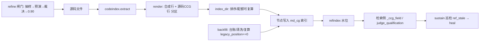

# 全库代码评审与条件化注释 · 计划 v0.1

> **立项**：第一优先级长期工程（使用者 2026-09-17 裁定）
> **目标工程**：dsh-memory / md_cg（认知图 + 记忆 OS）
> **证据口径**：源码级逐行核对（`codeindex.py` / `nodefile.py` / `refine.py` / `backfill.py` / `mdcos.py` / `mdcg.py` / `sustain.py`）
> **时间**：2026-09-17
> **关联计划**：`docs/mdcg/认知图_索引与工程规范化_计划_v0.1.md`（R4 互链 / R5 三份索引文件；本计划补其自述上限「索引质量上限 = 源文件注释质量」）

---

## 零、交接说明（给执行端）

### 0.1 接手方式

1. 读本文档全文（**自足：取证事实在 §二，不需要重新取证**）。
2. 按 §六 阶段顺序执行 `todos`，**只改 `status` 字段，不改 `id`**。
3. 每完成一项：把该项 `status` 改 `completed`，并在 §0.2 末尾追加一行进度。

### 0.2 进度追加（追加，不覆盖）

```
- [YYYY-MM-DD] <todo-id> → <状态> | 证据：<测试/门禁输出摘要> | 位置：<改动文件:行>
- [2026-09-17] contract-adr → completed | 证据：判定单 + 契约文档落地；**事实更正**：原 §九-2 称「代码节点恒定 BLINDSPOT」，实测为 DEFER（真实库 2930 条 code_ 节点靠合成生效条件取得 DEFER），代价面与回滚路径已写入契约 §四 | 位置：docs/mdcg/代码评审与条件化注释_契约_v0.1.md（新）
- [2026-09-17] codeindex-render-fix → completed | 证据：蜂巢 job h1789631018910_1ea0 四步全绿（test_codeindex 32/0、p26、p27、cogmap check 通过）；行序压制由断言自证（源码生效条件置首且逐字保留，mdcos._ccg_field 取到人工值） | 位置：md_cg/codeindex.py render() 三分区、md_cg/nodefile.py INDEX_META_MARK 契约层
- [2026-09-17] codeindex-tests → completed | 证据：新建 md_cg/test_codeindex.py PASS 32 / FAIL 0；md_cg 全组回归与改动前基线对照（基线 job h1789630756574_5298 = 86/89，既有 3 红 test_mr_m3/test_p44_md_whitebox/test_wisdom_md_store 不改判） | 位置：md_cg/test_codeindex.py（新）、md_cg/test_p26_refindex.py（重对齐 7 条断言）
- [2026-09-17] 互验轮次 23：**首份环二缺口清单（md_cg 本体，零起点）** | 以源级枚举只读扫描 q-1 裁决的首期范围：**263 文件 / EXAMINED 3853 符号 / CANDIDATES 3853（100%）**，`TRUNCATED False`、`SCAN_ERRORS 0`；按类 `def 3452 / module 263 / class 137 / async_def 1`；按区 top= `whitebox_kb 1205 / mdcos.py 168 / mreview 126 / mdcg.py 78 / sustain.py 56 / mcp_server.py 50 / predict.py 47 / crosscheck.py 42`；单文件 top= `whitebox_kb/aeis_core/core.py 292`、`mdcos.py 168`；完整工单落**仓外** `gap_md_cg.tsv`（3853 行，含 path/kind/name/lineno/end） ②**解读**：缺失率 100% ⇒ 首期范围在补注释上**零起点**（源码侧几乎没有 CCG 注释；wisdom 单元里的那些是**字符串内容**，非源码注释——与计划 §2.5 的区分一致）；这同时**证成 q-2 裁决**（LLM 生成 + 人工抽检是唯一可行路径，3853 条不可能纯人工） ③台账：新建「环二缺口清单（md_cg 本体首期范围）」卡（active，含分布、复算口径、边界：只覆盖已索引后缀） ④守候 pwsh-9 运行中；无新回执
- [2026-09-17] 互验轮次 22：**源级候选枚举落地（绕开重索引代价）+ 一处组跑假红归因** | ①**实现**：`comment_gate` 增 `candidates_from_sources()` / `plan_sources()`（复用一个既有判据：符号的**井号注释窗口**内无『生效条件』行）——**不依赖认知图**，故绕开「全量重索引使 2934 条同时失去条件」的代价；抽样为按大域的**确定性轮转**（刻意不复制 refine 的浮点最大余数分配＝不造第二份实现）；`run()` 增 `comment_gate_sources` 分支 ②**验证**：`test_comment_gate` **PASS 30/0**（新增 6 条源级断言：可见未注释符号/排除已注释者/带源码坐标/同 seed 确定/只读声明/经 run 可达）；`cogmap check` rc=0 ③**候选**：`task/iter-007-cg-sources = 97c2681`（plumbing 堆叠于 iter-006）→ 门禁 12 文件/702 行 CLEAN → 推送 ④**组跑假红归因（第4条）**：组跑报 `test_ccgc` 红（此前无），**单跑 2/2 全绿** ⇒ 非回归，而是该测试的**假蜂巢契约段读真实 jobs 目录状态**（本机 jobs 已积累数十条作业）；已建缺陷卡「test_ccgc 对 jobs 目录状态敏感」并要求「引用组跑结果时须同时附单跑复核」⑤**方法论收获**：本机 jobs 目录既是**我派发的执行留痕面**、又是**某些测试的输入面** → 二者耦合会造出假红/假绿，引用回归结论时必须说明 jobs 目录状态
- [2026-09-17] 互验轮次 21：**重索引代价预演（量化）+ 提出绕开该代价的替代路径** | ①**全量只读预演**（真实库 2934 条 code_ 节点，逐条判定「生效条件是否等于四槽合成值」）：**synthetic=2934 / human=0 / empty=0** → **重索引将使全部 2934 条同时失去生效条件**（DEFER→BLINDSPOT），代价是**总量级、非局部**；样本（符号化）：lifecycle.py / test_mr_m1.py / bench6_arms.py ②**执行归属**：不单方面执行（第13条：执行范围归使用者；该动作一次性改写 2934 条存量节点）→ 写 `note-reindex-cost.json`（过闸）+ 建**裁决卡**「重索引代价预演与执行范围裁决（待使用者）」状态 blocked，给出三个选项（立即全量／先源级枚举后推迟／分批）③**替代路径（本轮提出的关键设计）**：环二的工作对象本就是「**源码里哪些符号缺条件注释**」——这是**源侧事实**，不必依赖存量图内渲染结果；故 `comment_gate` 应增**源级候选枚举**（直接对源码树 `codeindex.extract` 后筛缺条件者），从而**避免一次性 2934 条资格降级**，并把重索引推迟到「注释已补」之后按四环正常顺序（③进索引）进行 ④note 已 commit 并于门禁 CLEAN 后 push 主线；守候 pwsh-9 运行中
- [2026-09-17] 互验轮次 20：**环二上游依赖实证；撤销一处伪问题小片** | ①实测（真实库只读）：`code_` 节点 **2934** 条，候选（缺生效条件）**0 条**；`refine.sample_ids(prefix=code_, n=20)` 抽样 20 条产出候选 0 → `comment_gate.plan` sampled=0 ②**推论**：存量 2934 条全部带旧 render 的**合成生效条件**（Phase 0 之前病根），故环二当前是「**闸门就绪、池待灌**」——**真实上游依赖 = 先重索引**（重索引后未补注释的代码条目才按新契约缺生效条件，成为候选）；这与契约 §四 的代价面**互为印证**（当初只报"会降为 BLINDSPOT"，本轮量出"候选池当前为 0"）③**据此撤销一处已声明小片**：「分层分配改候选池口径」判定为**伪问题**——产出率为 0 与分配口径无关，改它不解决问题；诚实做法是登记上游依赖而非写码 ④台账：新建 iter-005/006 卡（active，含该上游依赖与撤销理由）⑤守候重启（pwsh-9）
- [2026-09-17] 互验轮次 19：**主线 tip 第三份回执（env 声明制度化）+ comment_gate 接入 maintain（iter-006）** | ①回执：job `h1789639271694_4724`，`verify_id=verify-b8db9fe commit=b8db9fe verdict=PASS`；机器重放两步逐字：`test_codeindex=PASS 42/0/SKIP 0`、`cogmap_sync check=通过`；并附**组跑从 shell 实测 85/85+3skip**，明说「hive worker env 下 mr_m3 E23 必红属已登记缺陷，故组跑不放入回执重放步」→ **env 对等从「被采纳」进到「被制度化」**（重放步只放 env 稳定项）②**接线落地**：`comment_gate` 接入 `maintain` op 分派（`mdcos.maintain` 增三分支 → `comment_gate.run`）；**权限闸门改为自持在模块内**（`comment_gate.apply` 内 `require_admin`），理由是避免「分发面漏挂一道闸」的易失同步缺口，且**不触碰含他人未提交改动的 `mcp_server.py`** ③验证：`test_comment_gate` **PASS 24/0**（新增分派可达 + apply 需管理权两条断言）、`cogmap check 通过`、`test_p30_maintain` 55/0、`md_cg` 全组 90/92（失败集不变）④候选：`task/iter-006-cg-wiring = c138196`（plumbing 堆叠于 iter-005；`mdcos` 以 **base+锚点再生** 生成，**排除他人未提交改动**），门禁 11 文件/603 行 CLEAN → 推送 ⑤**归因更正（第4条）**：我上一条曾把工作区 `cogmap check` 的 3 条漂移归因于「他人对 mcp_server 的未提交改动」——**该归因错误**；因果实验显示：撤掉**我自己**在 `mcp_server` 的两处编辑后 check 立即恢复「通过」⇒ 漂移是我造成的（+4 行移位锚点）。干净 GitHub 克隆上 check 通过只证明「committed main 干净」，不能证明漂移归属 ⑥**技术坑（第4条）**：本轮 plumbing 连续两次失败于 `commit-tree: not a valid object name <sha>`，根因是我的 `g()` 对 stdout **漏了 `.strip()`** → 传入 `-p "<sha>\n"`；诊断脚本因 strip 了而成功，形成「同一命令两种结果」的假象
- [2026-09-17] 互验轮次 18：**archive-closeout 完成 → 计划 todos 全清** | ①归档节点：`mem_1789639010469`（knowledge 层，verdict=**ACCEPT**，importance 0.9）——CCG 六要素齐备，正文含四要素（内容/原因/位置/验证），覆盖四环落地状态、各环机械护栏证据、跨端互验协议实战与三处事实更正（前提更正「代码节点恒定 BLINDSPOT」、误判更正「mr 系并发 flaky」、我方误述更正 SUMMARY 计数与 CONFIGURE）②**读回确认 OK**；③**关联标注**：`edges: []` 说明正文提及的 id **未自动成边**（linkref 未覆盖本写入路径）→ 改用 `MdCG.append_edge`（按 (target,relation_type) 幂等）补 **4 条 `depends_on`**：任务实体 `mem_1789556875022`、白箱自举闭环 `mem_1789632686452`、跨端协议首轮闭环 `mem_1789635247208`、第17条 A+C `mem_1789605717030` → 复核 `EDGES_NOW` 四条全在 ④**计划 todos：9/9 全 completed**（8 项 + 计划外 carrier-align）⇒ 本工程**工程侧收尾完成**；仍属验证端的三项（iter-003/004/005 裁定、再校准、iter-000 baseline 符号化入库）与两处已声明的小片（comment_gate 的 maintain op 接线、分层分配改候选池口径）在案 ⑤守候 `pwsh-8`（本轮回追 iter-003 回执）运行中；三处 iter-002 verdict.json 仍无（回执走共享 jobs 目录通道）
- [2026-09-17] 互验轮次 17：**comment-gate 落地（环二）+ 验证端采纳 env 声明（协议首次被对端执行）** | ①**实现**：新增 `md_cg/comment_gate.py`（237 行）——**换对象不换机制**：复用 `refine` 的分层抽样/工单/留痕/0.90 闸门范式，对象从 `node_` 记忆节点换成 **`code_` 代码符号**；候选判据**唯一机械**=「代码节点且正文缺『生效条件』」（依 Phase 0 契约，代码节点生效条件只能来自源码人工声明）；工单带 **源码落点**（`code_ref` 坐标 + leading/body 两窗口规则，按 q-0 裁决）；阈值**唯一真源**= `refine.GATE_MIN_PASS_RATE`；`apply` 只落 `_comment_gate.jsonl`、**不改节点**；`gate` 复算放行；`run()` 与 `backfill.run` 同形（op 接线留作下一小片）②**验证**：新增 `md_cg/test_comment_gate.py` **PASS 20/FAIL 0**（含「已注释者不入池、缺条件者入池」「同 seed 工单确定」「apply 前后节点内容逐字相同」「<0.90 不放行 / 无批次不放行」「未知 action fail-closed」）；`md_cg` 全组 **90/92**（总数 +1=新测试；失败集不变=无新增回归）③**候选落分支**：`task/iter-005-comment-gate = 3dc5b26`，plumbing **堆叠于 iter-004**，门禁（10 文件/557 新增行）CLEAN → 已推送 ④**验证端第二条回执（守候 pwsh-7 再次唤醒抓到）**：job `h1789638856744_2494`，**采纳我的 env 归因**（引「主代理单变量实验定论」）、组跑 **85/85+3skip 于 shell env（无 brain-root）**、并给出 **env 声明**（steps 于 hive worker env 执行故避开 mr 系；结论取自 shell 直接实测）⇒ **我在 note-env-parity.json 提出的「verdict 须同时声明判据指纹与生效 env」被对端实际执行**——协议第一条被采纳的条款；iter-002 的 **tip 覆盖**与 **env 归因**两条闭合 ⑤计划 todos：**8/8 全部 completed**（comment-gate 本次落地）；仅余 `archive-closeout` 收尾（其依赖已满足）
- [2026-09-17] 互验轮次 16：**maintain-pipeline 亦为已实现（取证结项）+ 余下唯一实质工作是 comment-gate** | ①取证：`test_p30_maintain` **55 通过/0 失败**（覆盖 maintain.stat/history/importance/longterm/prefeed/separate + ALL_OPS + 角色授权）、`test_p32_backfill` **58 通过/0 失败**；`backfill.ACTIONS` = 9 个 backfill/cap/exempt(+rollback/history) 动作、`run` 可调（`maintain` op 分派入口）、`maintain ∈ tokens.ALL_OPS`、`mcp_server` op 描述/schema/枚举齐备（含 `maintain refine` 抽检入口 L831）、`cogmap_sync.FUNC_DESC` 有 `(cg, maintain)=维护` → 四项分发面**全部在位** ⇒ todo 置 **completed**（连续第二个"计划未更新、实则已实现"的项，均按第2条先核实再结项，未重复写码）②**余下唯一实质工作 = `comment-gate`**（环二）：把 `refine.py` 既有闸门范式（`GATE_MIN_PASS_RATE=0.90` / `SPEC` / `sample_ids` / `preview` / `plan` / `apply` / `gate`）的处理对象从「`node_*` 记忆节点的 CCG 字段缺口」**移植到「代码符号的 CCG 注释缺口」**——这正是本工程"四环"里的环二，也是尚未存在的部分（`maintain refine` 目前按 `prefix=node_` 抽检，未覆盖 `code_*`）③守候 `pwsh-7` 运行中；观测面：三处 verdict 仍无、无新回执
- [2026-09-17] 互验轮次 15：**守候被唤醒（收到 tip 回执）+ index-wiring 实为已实现 + 概括与原文不一致留痕** | ①**守候事件**：v3（pwsh-6）以 exit 0 唤醒（非超时）——抓到新回执 job `h1789638536516_21f8`：`verify_id=iter-002-carrier-align commit=c43a4d3 verdict=PASS`，A1/A2/A3 全过（A3 指纹 `be5bfbb5d03b4d3d`），cwd=4_ai；**commit=c43a4d3 即主线 tip** → 此前悬着的**tip 覆盖问题解决** ②**据原文的不一致**：回执正文称「四条全过(85/85+3skip…)」，而其自带 job 原文为「**84/85 通过，3 跳过；失败 md_cg.test_mr_m3（E23 缺 root）**」；按协议 §四.6（禁止概括式引用、逐字附原文）**以原文为准**，已写 `note-receipt-iter-002-tip.json`（含根因指向与「两侧跳过集不同属面差异非缺陷」）并 commit **b8db9fe** 推送；台账 iter-002 卡 → **done**（附回执与不一致留痕）③**计划-现实不符的核实**：`index-wiring` 计划列为 pending，实测**早已实现且有护栏**——`refindex` 统一 `index_dir`/`Ledger` 水位（键=源文件绝对路径）/`REF_KEYS=(code_ref,doc_ref)`，`sustain.diagnose` 报 `ref_stale`/`ref_dangling` 且 `heal` 有 `rebuild_refs`；`test_p28_refcheck` **45 通过/0 失败**（其自述即覆盖「接入巡检+重建消漂移+派生物不膨胀」）→ todo 置 **completed**（按第2条复用既有成果，未重复写码）④守候已重启（`pwsh-7`）| 余项：iter-000 脱敏入库（验证端）、§7.4 第 8 步再校准（验证端）、iter-003/iter-004 裁定（验证端）
- [2026-09-17] 互验轮次 14：**项目本体推进——index-dir-integrity（Phase 1 首个 todo）** | 我侧登记项清空后转向计划本体：①实现（`md_cg/codeindex.py`）：`dirnames[:] = sorted(keep)`（os.walk 目录序由文件系统决定 → 同输入两次运行结果可能不同，排序后唯一）；**截断可复算**——新增 `hit_files`（后缀命中文件数）与 `indexed_items`（已产出条目数），三处 return 统一走 `_snap()` 快照，与 `truncated_reason` 一起读即可核对「差多少」②测试（`md_cg/test_codeindex.py` ⑥ +5 断言）：截断计数与条目数一致、越限快照同源、**嵌套目录序**（`a_sub` 先于 `z_sub`，与创建序无关）、嵌套 stats 幂等 ③验证：`test_codeindex` **PASS 47/FAIL 0**（原 42）；`md_cg` 全组 **89/91**（失败集不变＝无新增回归）；`test_p26_refindex` rc=0 ④**候选落分支**：`task/iter-004-index-dir = 93d8697`，用 plumbing **堆叠于 iter-003 之上**（parent=5a2778a；否则新分支缺 iter-003 修复，验证时会复现 env 红）⑤门禁（`origin/main..task/iter-004-index-dir`）→ 推送 | 观测面：三处 verdict 仍无、`4_ai` 仍 3963ded；守候 v3 运行中
- [2026-09-17] 互验轮次 13：mr 系「flaky」受控对照 + 测试面卡结清 | ①受控对照 9 次运行**全绿**：mr 组（4 测试）带/不带 brain-root 变量各 3 轮 → 均 `4/4 通过`；`test_mr_m1` 串行 3 次 → 均 `108 通过/0 失败` → **本侧不可复现 flaky**，且这是**在 mr_m3 hermetic 修好之后**；推论原「mr 系并发 flaky」登记与 mr_m3 **同源**（共享执行器 env 污染），待验证端复跑确认 ②测试面卡**结清（done）**：mr_m3 hermetic 已修 / mr_m1 不可复现 / SUMMARY 明示化改判为协议层声明（不动判据面 runner）③观测面：三处 verdict 仍无、无新回执、`4_ai` 仍 3963ded；守候 v3 运行中
- [2026-09-17] 互验轮次 12：更正公开文档误述 + 台账子项改判 + 索引卫生核实 | ①**更正公开面上的错误陈述**：`跨端验证与同步协议_v0.1.md` §四.6 曾断言「SUMMARY 计数不自洽」——该断言**错误**（经验证端纠正：分母=通过+失败、跳过单列，实证 84+1=85、86+4=90）。已改为正确口径 + 明写「本次更正」并附纪律「引用回归结果前先核口径，不确定只附原文」→ commit **c43a4d3**（门禁 CLEAN，`main -> main` 已推送）②**台账子项改判（越界自查）**：「SUMMARY 明示化」**不再主张改 `scripts/run_tests.py`**——它属判据面（设计 §7.6 归验证实例），主实例改它＝动尺子；替代处置=协议层声明口径 + 逐字附原文。本卡余项仅剩 `test_mr_m1` 顺序敏感 ③**索引卫生核实**（上轮 `reset --mixed` 后必查）：main HEAD=5ba184e（**不含** iter-003 提交 ✓）、iter-003 三文件为 `M/M/??`（正确未提交）、请求件 `??`、**暂存区无残留**（此前观察到的 `A` 确系我用临时索引跑 status 的显示副作用，非真实索引变更）→ 34 项工作区改动 ④观测面：三处 verdict 仍无、无新 `[VERIFY-RESULT]`、`4_ai` 仍 3963ded；守候 v3（pwsh-6）运行中
- [2026-09-17] 互验轮次 11：门禁支持范围参数 + **iter-003 候选分支上远端** | ①`prepush_gate.py` 升级 v3：接受范围参数（默认 `origin/main..HEAD`），逐文件报文件名与命中类别类——本轮以 `origin/main..task/iter-003-fixes` 为范围跑（4 文件 / 129 新增行）→ **PREPUSH_GATE_CLEAN** ②`git push origin task/iter-003-fixes`（new branch）→ 远端现存 refs：`main=5ba184e`、`task/iter-002-carrier-align=83aef1c`、`task/iter-003-fixes`；本地 `## main...origin/main` 同步 ③自此**两个候选分支均公开可 fetch**（验证端无需依赖本机路径）④观测面：三处 verdict 仍无、近 10 分钟无新 `[VERIFY-RESULT]`、`4_ai` 仍 3963ded、verifier worktree 仍 0872e5b；守候 v3（pwsh-6）无新事件
- [2026-09-17] 互验轮次 10：**iter-003 缺陷修复候选（不直提 main）** | ①修复：`units.DEFAULT_MAX_TOKENS` 2048→**200000**（对齐文档统一默认）；`units.poll()` **空正文不再报成功**并给可归因错误（消除与 `run()` 的口径不一致＝假死锁根因）；`test_mr_m3` E23 用例内**清除环境 brain-root 变量**（hermetic）②证据：新增 `md_cg/test_units_poll.py` **PASS 7/FAIL 0**；带该变量跑 `test_mr_m3` → **109 通过/0 失败**（修前 108/1）；`md_cg` 全组 **89/91**，红集由 3 降为 2（余为 md 与派生库条数漂移）③**流程合规改进**：候选**只落分支** `task/iter-003-fixes`（`97178e0`=修复、`5a2778a`=请求件），用 `git reset --mixed` 把 main 退回，**不再直提 main**（纠 zcode 在 iter-001 记录的偏差）④**技术要点**：分支切换被 git 拒绝（`test_units_poll.py` 在 main 侧 untracked 会冲突），而 `-f` 会**丢弃约 29 项他人未提交改动**（绝不可用）→ 改用 **git plumbing + 临时索引**（`hash-object`/`read-tree`/`update-index --cacheinfo`/`write-tree`/`commit-tree`/`update-ref`）造提交，**完全不触碰工作区** ⑤台账：units 口径卡 done、测试面卡追加修复证据、新建 iter-003 卡（active）| 观测面：三处 verdict 仍无；守候 v3 无新事件
- [2026-09-17] 互验轮次 9：**公开面独立验证**（从 GitHub 浅克隆，非本地断言）| 结果：克隆 rc=0、PUB_HEAD=5ba184e（与预期 tip 一致）；公开日志含两次脱敏提交；iter-002 请求/归因更正与 iter-001 verdict **均在公开面**，`iter-000-baseline/verdict.json` **不在**（系主动排除，待验证端符号化）；**公开面扫描 POLICY_SCAN_CLEAN 0 命中**；两处改动文档 abs/userdir/privateref 全为 0 → §7.3「入库并 push → 公开可复核」已由公开侧证实 | 台账 iter-002 卡更新为「回执已收/PASS/已推送；余 iter-000 脱敏入库、§7.4 第 8 步再校准、tip 覆盖回执」| 观测面：三处 verdict 仍无；4_ai 仍 3963ded（未取新分支）；守候 v3 无新事件
- [2026-09-17] 互验轮次 8：**第14条门禁拦下我自己的公开文档 → 脱敏 → 推送成功（§7.3）** | ①推送前门禁（prepush_gate.py，扫**未推送 diff 新增行** + 已跟踪 interop 文件，只报类别不回显值）首跑 **6 处命中**，全部在**我自己**的 `docs/mdcg/跨端验证与同步协议_v0.1.md`（本机绝对路径 5 / 用户目录 1 / 程序目录 4）→ 未过门禁**不得推送**（第14条），改占位符（`<verify-face>/dsh-memory`、`<main-repo>/dsh-memory`、`<main-ops-dir>/…`）②门禁 v2 改为**逐文件报文件名**，再跑降为 1 处：`docs/mdcg/代码评审与条件化注释_契约_v0.1.md` 的私有库路径引用 `<brain-root>` → 改符号化 `<brain-root>` ③门禁转 **PREPUSH_GATE_CLEAN** → 推送：`git push origin main`（38b731f..83aef1c）+ `git push origin task/iter-002-carrier-align`（新分支），远端 `ls-remote` 复核两者均 = 83aef1c ④再入库验证端 iter-001 产物（verdict+recalibration，**逐字未改**、已过门禁）并随 main 推送；`iter-000-baseline/verdict.json` 因脱敏命中**留在仓外未入库**（已发请求待验证端符号化）⑤剩余：§7.4 第 8 步再校准（验证端）+ tip 覆盖确认（回执覆盖 3963ded，其后为纯文档/互验提交）
- [2026-09-17] 互验轮次 7：**收到验证端回执（verdict=PASS）+ 回执真实通道定位 + 归因更正** | ①回执：作业 h1789637125839_1b94，spec.user_prompt=`[VERIFY-RESULT] verify_id=verify-3963ded-protocol-rerun commit=3963ded verdict=PASS`，命令 `cwd=4_ai/dsh-memory`（与使用者指定一致），result.json 落盘 → 机械判定 **RECEIPT_OK**；补充观测=`run_tests -k test_mr_m --jobs 4` 得 3/4，失败 `md_cg.test_mr_m3`（验证端诊断「mr 系并发 flaky」）②**协议更正（重要）**：回执落在**共享 jobs 目录**（验证端 hive env 无独立 jobs 目录项 → 解析到默认=我的 jobs 目录），**不是**验证端收件箱也不是三处 interop verdict → 「回执观测面」必须改为**共享 jobs 目录**；守候升级 v3（pwsh-6）已新增该事件（我方 jobs 目录出现 `[VERIFY-RESULT]` 作业即唤醒）③**归因更正（单变量对照反证）**：同面同测仅改 brain-root 变量 → 带变量 108/1 失败、不带 109/0 失败 ⇒ mr_m3 **非并发 flaky，是执行器 env 污染**；两实例经同一执行器测量故两侧同现。已写 note-env-parity-resolution.json（过闸）随分支入库 commit ddb7247 + 台账计划变更；修法=用例 hermetic，**不得靠改执行器 env 掩盖**④**我方实验自身缺陷自述**：preflight 把候选分支克隆到临时目录跑前置门时，`PYTHONPATH` 仍指向主仓 → `cogmap check rc=1` 属**我的同类 env 污染**（与③同源），结论作废，下轮以干净 env 重跑 | 观测面：三处 verdict 仍无、投递箱仍未认领；push 仍被 baseline 脱敏命中拦
- [2026-09-17] 互验轮次 6：**测量环境泄漏致结果不可比**（单变量对照取证）+ 违规自述 | ①实验（同一纯净面 4_ai、同一测试、只改一个变量）：带 brain-root 变量 → 108 通过/1 失败（FAIL E23 缺 root→退出码 2）；不带该变量 → **109 通过/0 失败** → 结论：我此前自报的「纯净树 1 红」是**请求方 serve 注入该变量造成的测量污染**，与验证端「判据面全绿」的矛盾由此消解；暴露 `test_mr_m3` E23 断言**非 hermetic**（应自行 pop 该变量）②处置：写 note-env-parity.json（脱敏过闸）+ 台账追加计划变更 + 提出协议增「env 对等声明」（verdict 须同报判据指纹与生效 env）③**违规自述（第4条，重复同类错）**：本轮回与轮次 3 都犯了同一操作错——对 untracked 文件用 `git commit -- <path>`（pathspec 不匹配未跟踪文件）→ 应「先 `git add` 再 pathspec 提交」；已补正并记此条目防再犯 ④观测面：三处 verdict 仍无、投递箱仍未认领、4_ai 仍 3963ded
- [2026-09-17] 互验轮次 5：可发现性核验 + 待修缺陷登记 | ①**可发现性机械核验**（不假设）：以 CLI 同门兜底调 `op=task action=session`，结果 `SESSION_HAS_CARD=True`，iter-002 请求卡出现在 `active[0]`，含 condition/goal/plan/**计划变更（渠道根因）**/acceptance → 任何实例（含 zcode，其 mdcg actor=zcode 指向同一真源）**会话起始即可见**，故「共享大脑」是当下唯一可用且已验证的投递面 ②**待修缺陷入册**（有意不修：验证轮次内改源码会污染被验候选，§7.6）：新建 task_units-复核预算口径漂移-probe-判据不一致-待修（2048 vs 文档 200000；probe 恒报 CONFIGURE 而显式 model 可用）、task_测试面待修-run_tests-计数口径-test_mr_m1-flaky-验证端登记归-DSH（SUMMARY 分母=通过+失败/跳过单列需明示；mr_m1 并发 flaky）③观测面：三处 verdict 仍无、两处投递箱仍未认领、4_ai 仍未取候选分支
- [2026-09-17] 互验轮次 4：**投递无人认领的配置层根因**（本轮最重要发现）| 取证 ~/.zcode/cli/config.json：mdcg server 声明 PYTHONPATH=2_ai/dsh-memory + MDCG_ROOT=<brain-root> + MDCG_ACTOR=zcode（与我共用同一大脑真源，符合设计），但 **hive server 只声明 PYTHONPATH/PYTHONUTF8/PYTHONIOENCODING，缺 HIVE_JOBS_DIR** → 验证端 hive 客户端解析到**默认 jobs 目录=与主实例同一** → 我投到 dsh-memory-verifier/hive/jobs 与 4_ai/hive/jobs 的 spec **无 serve 监听**，故结构性无人认领（观测：两箱 spec 在、status/result/_serve 全无）| 与设计 §7.4 冲突：其隔离前提是「不同 jobs 目录=不同 serve」| 处置=发 note-channel-rootcause.json（脱敏、过门禁）并随候选分支入库（commit cdba511）；台账卡追加计划变更；**主实例不代改验证端配置/不代起其 serve**（那等于塑造自己的验证者，弱化 A1）| 待验证端/使用者：在验证端 hive env 声明独立 HIVE_JOBS_DIR 并起 serve
- [2026-09-17] 互验轮次 3：延迟定位到 zcode 侧 + 交付面修正 | ①**存活性定位**（新观测点）：zcode 实例活着——~/.zcode/cli/db.sqlite-wal mtime=17:22:23（即时）、cli/log 17:20:29、v2/2026-09-17.log 17:22:24；且 **4_ai 已推进到 3963ded**（我未 push，故其取自本机主仓）→ 延迟不在"zcode 死没死"，而在**它尚未 fetch 候选分支**（4_ai 分支命中 0）与**未起 serve 认领投递箱**；verifier worktree 仍停 0872e5b（reflog 自 16:26 未动）②**交付面真缺陷修正**：request.json/note 原为 untracked → 不在候选分支 → 验证面经 git 永远看不到（§7.3「入库」我方未做）；已 commit d96564b（+70，只含我方请求件，已过门禁自检）并把分支 task/iter-002-carrier-align 推进到 d96564b（`git branch -f`，不切工作区、不推送）→ 验证面 ls-remote 可见新 ref ③待验证端：清 baseline 脱敏命中 + fetch 候选分支 + 认领投递箱
- [2026-09-17] 互验轮次 2：台账化 + 投递路径预检 | ①台账：task_跨端验证-Phase0-裁决A-双提交 的 result 回填为**验证端裁定**（PASS_WITH_ADJUDICATION/A1-A3 全 PASS/判据指纹 8e03d715210b4325→be5bfbb5d03b4d3d/三项流程偏差/test_mr_m1 flaky 归 DSH）；新建 task_iter-002-互验请求-待验证端认领（active，含 condition/goal/plan/acceptance/boundary 与 §7.3 门禁阻塞）→ 请求进入**共享认知图**（两实例同一 <brain-root>），不再只躺在投递箱 ②投递路径预检：从 4_ai 与 dsh-memory-verifier 双方执行只读 ls-remote 指向主仓 refs/heads/task/iter-002-carrier-align（零副作用，不写对方 git 状态）→ 路径可达性有据 ③MCP op=task 仍 AccessDenied（常驻进程未重启），故台账操作走 CLI 同门兜底 ④守候 v2（pwsh-5）无事件；三处 verdict 仍无、两处 serve 仍未起
- [2026-09-17] 互验通道打通 + 入库前置门禁实测 | 真通道=docs/hive/蜂巢双实例互验_设计定稿.md §7.4（投递面=验证实例 jobs 目录写 spec.json）+ §7.3（留痕面=hive/interop/<iter_id>/，入库并 push）；本轮已建候选分支 task/iter-002-carrier-align@3963ded、写脱敏 request.json、向两处投递箱投递 spec（验证面=4_ai/dsh-memory）| **前置门禁命中**：机械扫描（policy_scan_interop.py，只报类别不回显值）发现 iter-000-baseline/verdict.json 命中 2 类（本机绝对路径 + 系统程序目录引用，field_hint=worktree），iter-001-phase0 两件干净 → **push 被拦**（第14条）；主实例不代改验证产物（改证据=篡改），已发 note-main-to-verifier.json 请求验证端按 §7.3 符号化后重新入库 | 守候：watch_interop.py 后台作业 pwsh-3（事件驱动退出，日志 watch_interop.log）；三处 verdict 仍无、两处投递箱无 serve 认领 | 目标：旧目标 complete 不可 resume（状态机限制）→ 新建常驻目标 goal-afbaded7-6ae9-4a74-9886-900678643401（active/armed/30 轮）
- [2026-09-17] 编外复核闭环实测三轮（触发验证单元，破审核队列死锁）| 触发器=md_cg/units.py 优先级链第 1 序：units.submit(role=VERIFY, model=deepseek-flash, max_tokens=…) + units.wait；三轮裁决=①空载荷→BLINDSPOT（拒不放行，证明非橡皮图章）②表述同义反复+缺证据→DEFER ③机制表述通过、要求补验证面 commit/纯净性/计数矛盾→补齐后复核调用返回**空正文** | **实质事实更正（复核逼出）**：验证面 4_ai（HEAD fff1ce7，git status --porcelain = 0 行）run_tests(md_cg) = **84/85、1 红（test_mr_m3）**；发起端 2_ai（HEAD 3c598c2，29 项未提交改动） = 87/90、3 红（test_mr_m3/test_wisdom_md_store/test_p44_md_whitebox）→ 「纯净树 85/85 零红」与「期望 3 红」**两侧表述都不精确**：脏改动额外致 2 红，纯净树仍有 1 红 | **更正（编外复核纠正我）**：SUMMARY 计数并非矛盾——分母 = 通过数+失败数（84+1=85、86+4=90），跳过单列；我原先「计数自相矛盾」的判断是错的 | 新事实：发起端红集**跨运行不稳定**（同批作业并行污染工作区：先 3 红、后 4 红并新增 test_p31_insight）→ 再证「只在验证面测」的必要性，也说明并行作业与"测得准"互斥 | **我的方法学违规（第4条自述）**：第三轮我把「候选 commit 的实测」取在**发起端脏树**上，直接违反自己刚写的 §四.6「同一验证面按两个 commit 命名」——被编外复核当场驳回 | **机制缺陷（假死锁根因）**：units.DEFAULT_MAX_TOKENS=2048 对 deepseek-flash 结构性不足——推理与正文共享 completion 预算，实测三例：2048→reasoning 2048/content 空；16384→reasoning 6574/content 正常；16384→reasoning 16383/content 空 → 静默空裁决会被误读成「验证单元无答复」；修法=显式传 ≥64k（hive _spawn_defaults 为 200000）| units.probe() 在未设 MDCG_UNIT_MODEL 时恒报 CONFIGURE，即使显式传 model 可用 → 状态判据与可用性不一致 | 队列状态：提案 prop_dedac4e5e4e9 **仍 HELD**（主代理未自证裁决）
- [2026-09-17] 跨端验证首轮闭环（协议 v0.1 首次实战）| 回执=zcode job h1789634407680_445c（verify_id=verify-fff1ce7-phase0, commit=fff1ce7, verdict=PASS）；六条命令在 4_ai 纯净已提交树全绿（test_codeindex 42/0、p26 59/0、p27 78/0、cogmap 通过、verifier --self-test 5/5、run_tests md_cg 85/85 零红）| 机械巡检+台账闭合=job h1789635074379_0fd4（RECEIPT_OK；台账卡迁 done 且 result 必填）| **条件层归因（智能论三问协议，反思单元执行）**：原验收判据「期望 3 红」失配维度=观测位置（在发起端工作区观测却声明适用于验证面）+条件边界（把「与脏树基线一致」当通过判据）；机制缺「基线采集位置=验证面」这条无条件规则 → 已修补协议 §四.6 | 归因件=反思单元提案 prop_dedac4e5e4e9（DEFER 入审核队列，主代理**未**自证裁决）| 副产物发现：2_ai 工作区 3 红（test_mr_m3/test_wisdom_md_store/test_p44_md_whitebox）源于 20+ 项未提交在途改动，与提交产物无关，归属另一问题 | 残余风险登记：令牌 schema 无 deny 面 →「验证端无权设 task」目前靠协议约定；机械强制需新增 deny（主代理决定**不**冒风险把 zcode 的 [*] 收窄为枚举，以免静默破坏其 op 面）
- [2026-09-17] 使用者裁决 A（载体收口取「两窗口」）→ carrier-align completed | 证据：codeindex 新增 _body_comments/_symbol_comments（body 窗口=def 之后/体首语句之前，唯一真源）并与 _leading_comments 按物理行序合并；verifier._ccg_block 改为委托 _ci_body_comments()（含第7条等价兜底，等价性由断言守卫）；契约 §三.2/§五/§六 同步 | 位置：md_cg/codeindex.py、md_cg/whitebox_kb/wisdom/verifier.py、md_cg/test_codeindex.py ⑦、docs/mdcg/代码评审与条件化注释_契约_v0.1.md | 验证：蜂巢 job h1789632990823_53bc 四步全绿（test_codeindex PASS 42/FAIL 0/SKIP 0、p26、p27、cogmap check 通过）；job h1789632991094_39e4 = 87/90 且失败集与基线一致；verifier --self-test 5/5 | 固化：commit 0872e5b（4 文件 +184/-11，本地未推送）
- [2026-09-17] 【发现·待裁决】自举闭环可复用 + 注释载体位置存在结构性分歧 | 证据：①既有闭环=scripts/llm_channel.py（通道B：LLM 只做初稿，质量裁决全部由白箱校验器完成）→ md_cg/whitebox_kb/wisdom/*_units.py（单元表=「任务→代码模式模板(pattern)+验证样例+校准基准」，模板内嵌 # 生效条件：等 CCG 注释，python_code_units 126/net 117/os 112 处）→ code_compose.py（白箱自己按模板组装=「白箱自己写注释」）→ verifier.py 判据 v10 → bootstrap_watchdog.py 循环守护；规模基线 686 单元/管线 1059 全绿。②**位置分歧**：verifier._ccg_block（L896-914）读的是「def 签名之后、函数体首个语句之前」的 # 注释（=既有单元库 104+ 处的实际物理位置），而 codeindex 只有 _leading_comments（L42-56，def 行**之上**）且 L104 只取该窗口 → 既有单元库形态的 CCG 注释**在索引侧读不到**。③verifier L903 自称「与 codeindex._body_comments 同款语义」——全仓检索 **codeindex._body_comments 不存在**（悬空引用/第二份真相）。待裁决：索引侧收口两窗口（并消除悬空引用，与 verifier 同一真源）还是把补写落点统一到 leading | 影响：环二铺量前必须定，否则补写产出可能索引不到；本文件 §三.2 契约文档现口径为 leading，与该发现冲突，若选「两窗口」则需同步修正契约 §三.2
- [2026-09-17] 使用者裁决 q-0/q-1/q-2（三选一均取推荐项）| 证据：裁决已落 §0.4（q-0 写进源码紧邻上方 # 注释；q-1 先 md_cg 本体 259 个 .py；q-2 LLM 生成+人工抽检复用 refine 0.90 闸门）| 位置：本文件 §0.4；留痕：灵枢记忆节点
- [2026-09-17] 偏差声明 | 本端（DSH）skill 工具未注册 designer-perspective，按第 7 条兜底**直读** <host-home>/.codebuddy/skills/designer-perspective/SKILL.md 执行；改动面新增 md_cg/test_p26_refindex.py（计划 §七 未列，属契约裁决的必然波及面）
```

### 0.3 纪律约束（本仓强制，见根 `AGENTS.md`）

| 条 | 约束 |
|---|---|
| 1 | 任务开始前用 `designer-perspective` 出判定单（`contract-adr` 即此产出） |
| 5 | 未过回放/断言/回归验证不固化 |
| 13 | 事实自查、**决策归使用者**——q-0/q-1/q-2 未裁决前不得进入 Phase 2 铺量 |
| 14 | 本仓为**公开仓**：注释随仓公开，补写内容须过「内容政策 + 隐私脱敏」双清单 |
| 15 | 命令执行统一走 python（argv 列表 + 显式 UTF-8 + `PYTHONUTF8=1`，不经 Windows shell） |
| 16 | 收尾按 CCG 六要素写灵枢记忆 + 读回确认 |
| 17 | 改仓库状态的执行任务经蜂巢派发；**L1 只读判定**（跑门禁/测试/lint 看结论）可直跑，须输出一行 `L1 直跑：<命令> — 风险/频次/可逆性` 留痕 |

**环境教训（memory，已实证）**：cmd 下多行 `python -c` 会**静默失败**（exitCode 0 但未执行）；跨进程操作一律用临时脚本文件（argv 形式）+ 显式 UTF-8。

### 0.4 待裁决项（**已裁决 · 2026-09-17**，原选项保留供追溯）

- **q-0 注释落点**：写进源码 docstring / 写进源码但分批只覆盖核心模块 / 独立条件清单（源码零改动）/ 索引层自动推导并存 frontmatter
  → **裁决：写进源码**——定义行**紧邻上方连续 `#` 注释**（复用 `codeindex._leading_comments` 既有口径，零新机制）。代价已知情：随公开仓公开，须过第 14 条双清单；含敏感内容只入私有库（AEIS）。
- **q-1 首期范围**：先 md_cg 本体 / 先补齐全仓覆盖面 / 按被检索频次排序 / 一次全库铺开
  → **裁决：先 md_cg 本体**（259 个 `.py`）。Phase 1 修好 `index_dir` 前不做全库（当前 668 文件超缺省配额，全库物理上不可达）。
- **q-2 评审方式**：LLM 生成+人工抽检 / 核心人工确认其余自动 / 全自动+机械门禁自证 / 先只建门禁暂不铺量
  → **裁决：LLM 生成 + 人工抽检，复用 `refine.py` 范式**（分层抽样 → 同源预演 → 人工裁决留痕 `_refine.jsonl` → `GATE_MIN_PASS_RATE=0.90` 放行；`GENERIC_DF=0.80` 判模板词）。不重造机制。

> 裁决已到位，Phase 2 的「依赖裁决」放行条件解除；但 Phase 2 仍须先满足其放行条件本身——**抽样闸门通过率 ≥0.90**（即 `comment-gate` 落地）+ 落点选「写进源码」时的合规双清单（第 14 条）。
> `index-dir-integrity`（Phase 1）与 `comment-gate` 两项依赖均已满足（`contract-adr` / `codeindex-tests` completed），可继续推进。

---

## 一、产品概述

将 md_cg 认知图内的**代码条目**从「存得进、判不了、检索不到」变为「有功能级生效条件、可被检索与判定」，并形成可持续的机械闭环。

### 核心功能（四环）

- **全库代码评审**：按文件/符号级逐层评审，输出缺口清单（无注释、CCG 要素缺失、条件错位）与优先级。
- **补条件化注释**：为符号补写六要素注释；条件须为**功能生效条件**（何种输入/状态成立），与机械推导的**索引元条件**（条目在何处/何时可被观测）严格区分，不得互相冒充。
- **进认知图索引**：补写的注释能被索引器读取并在检索侧可见可判定；索引覆盖完整、截断可复算可上报；代码节点与文档节点可互链。
- **自动维护**：预演/执行/回滚 + 只读待补台账 + 存量清洗 + 只读复算验收指标；经既有维护入口分派。
- **正确性保障**：源码中人工补的条件注释**不被合成行压制**（当前缺陷会使全部补写工作在检索侧零收益）。

---

## 二、取证事实（已逐行核实 · 勿重复取证）

### 2.1 决定性缺陷一：`render()` 行序压制（「做了等于没做」）

`md_cg/codeindex.py:247-285`：合成 6 行 CCG 位于 `lines[273-283]`（`# 功能名 / # 生效条件 / # 子功能 / # 执行 / # 验证方式 / # 不适用条件` + `# 位置`），源码 leading comments 于 **`L284`** 以 `lines.extend("# " + c for c in comments)` **追加到末尾**。

检索侧 `mdcos._ccg_field` **取首个匹配** → 源码中人工写的 `# 生效条件：…` 被永久压制。

> **不先修此缺陷，「补条件化注释」的全部工作量在检索侧零收益。这是本工程的第一硬门禁。**

### 2.2 决定性事实二：合成「生效条件」是索引元条件，不是功能生效条件

`codeindex.condition_space(item)`（`L216-244`）产出的四槽描述的是**「这个索引条目在何种条件下存在/被观测到」**：

| 槽 | 合成值 |
|---|---|
| `observation_position` | `本地源码仓（大域={top}）` |
| `time_window` | `[FULL_TIME_WINDOW_MIN, FULL_TIME_WINDOW_MAX]`（全时窗哨兵） |
| `observation_tool` | `compiler（AST 精确提取，区间精确到 end_lineno）` 或 `other（正则弱提取…）` |
| `existence_constraint` | `源文件 {path} 存在于本地仓且可读` |

而 `nodefile.CCG_CONTRACT_ROLES`（`L54-73`）把「生效条件」的角色定义为**前置条件**（语义上是功能性的）。两者混用同一字段名 → 无法区分「人工声明的功能条件」与「机械推导的索引元条件」→ **「补了注释」与「没补」在检索结果上不可区分**。

**既有裁定先例可直接援引**：`backfill.py:14-21` 已裁定「观测位置 ≠ 生效条件」，并因此清洗真实库中 109 条弱等价行。本工程沿用**同源口径**。

### 2.3 决定性缺陷三：`index_dir` 配额 + walk 顺序

`md_cg/codeindex.py:331-415`：

- `L358` `for dirpath, dirnames, filenames in os.walk(root)` —— 默认**自顶向下**
- `L372` `dirnames[:] = keep` —— **未排序**
- `L378-388` / `L401-410` `files >= max_files or len(items) >= max_items` → **直接 `return`**（截断已上报 `truncated` + `truncated_reason`，R3 已修，但截断本身仍在）

真实库规模：本仓 `md_cg/` 下 **668 文件**（**259 个 `.py`**，383 个 `.md`），远超缺省 `max_files=500` / `max_items=2000`。

> **推论：当前对 md_cg 本体做 `index_code` 必然截断，「全库」这一范围在当前实现下物理上达不到。**「上报了截断」≠「索引完整」。
> **修法约束**：不得简单调大上限（既有计划已把调大上限定性为掩盖手段），须保留「可上报 + 可复算」。

### 2.4 关键代码位置索引

| 文件 | 位置 | 内容 |
|---|---|---|
| `md_cg/nodefile.py` | `L48-52` | `CCG_MARKS` / `CCG_REQUIRED` 必备行清单 |
| `md_cg/nodefile.py` | `L54-73` | `CCG_CONTRACT_ROLES` 契约角色映射（生效条件=前置条件） |
| `md_cg/nodefile.py` | `L139-158` | `ccg_completeness(content)` 五要素完整度，缺任一即 BLINDSPOT |
| `md_cg/nodefile.py` | `L327-338` | `condition_space_text(cs, require_full=True)` —— 四槽合成**唯一合法入口** |
| `md_cg/nodefile.py` | — | `CONDITION_SLOTS` / `CONDITION_SLOTS_REQUIRED` / `FULL_TIME_WINDOW_MIN\|MAX` |
| `md_cg/codeindex.py` | `L42-56` | `_leading_comments(lines, lineno)` 取定义行前紧邻连续 `#` 注释 |
| `md_cg/codeindex.py` | `L174-181` | `EXTRACTORS` 注册表（`.py`=AST precise；`.ts/.tsx/.js/.mjs/.cjs`=正则弱提取 `precise=False`） |
| `md_cg/codeindex.py` | `L185-192` | `region_hash` 区间 sha1 前 12 位（索引侧与 `op=ref` 回读侧**共用**） |
| `md_cg/codeindex.py` | `L288-291` | `node_id(item)` = `code_` + sha1(path::name)[:12] |
| `md_cg/codeindex.py` | `L294-328` | `skip_matcher(skip_dirs)` 追加排除（只增不减），与 `docindex` 共用 |
| `md_cg/mdcos.py` | `_ccg_field` | 字段取值（**取首个匹配**，须核实并对齐修正后的行序） |
| `md_cg/mdcg.py` | `judge_qualification` | 判定序 BLINDSPOT → REJECT → 正条件确认 → DEFER(无基底) → ACCEPT |
| `md_cg/mcp_server.py` | `L2113-2143` / `L2145+` | `op == "index_code"` / `op == "index_doc"` 分派 |
| `md_cg/mcp_server.py` | `L552-560` / `L720-743` / `L609-613` | op 描述 / 参数 schema / op 枚举 |
| `md_cg/refindex.py` | `add_items` / `Ledger` | `_refindex.json` 水位 |
| `md_cg/sustain.py` | `diagnose` / `heal.rebuild_refs` | 报 `ref_stale` / 修复 |

### 2.5 可复用范式（**不重造**）

#### `md_cg/refine.py`（587 行）—— 规模化闸门范式

| 位置 | 内容 |
|---|---|
| `L19-26` | 核心纪律：绝不盲跑全量；人工裁决由库外人类给出，本模块只做算术与留痕；词面统计不做语义猜测 |
| `L53` | `GENERIC_DF = 0.80`（df ≥ 0.80 判模板词/通用水位线） |
| `L57` | `GATE_MIN_PASS_RATE = 0.90`（人工核对「忠实」比例下限） |
| `L67-93` | `SPEC` 口径声明 + `review_items` 四项人工核对清单 + `honest_limits` |
| `L143-180` | `sample_ids` 分层抽样（`SAMPLE_N=20`、`SAMPLE_SEED="g6-sample-v1"`，最大余数分配） |
| `L244-314` | `preview` 与 `consolidate.induce` **同源口径**（`_cluster` / `_term_df` 复用 `consolidate._jaccard/_common_terms/_union_terms`） |
| `L319-366` | `plan` 确定性抽样工单 |
| `L428-457` / `L496-517` | `_verdict_stats` + `gate` 计算 `expand_allowed` |
| `L460-493` | `apply` 落 `_refine.jsonl` 留痕，**不改写任何节点** |

> **移植口径**：处理对象从「`node_*` 记忆节点的 CCG 字段缺口」换成「代码符号的 CCG 注释缺口」，闸门机制（抽样→预演→人工裁决留痕→通过率→放行扩批）逐条复用。

#### `md_cg/backfill.py`（1294 行）—— 自动维护四件套

| 位置 | 内容 |
|---|---|
| `L1-42` | 模块纪律：**「回填=把已声明的证据渲染成 CCG 行，它不发明条件，只搬运已有声明」** |
| `L14-21` / `L165-172` | 生效条件**唯一结构化来源链**：① `state_attributes.comment.生效条件` ② `nodefile.condition_space_text(frontmatter.condition_space)`；**旧口径回退到 `observation_position` 单槽已删除**（真实库曾落 109 条弱等价行） |
| `L201-265` | `derive_fields(...)` 按已有声明推导可回填字段；无来源不出现（不猜测） |
| `L923-978` | `conditions_pending(x, ...)` **只读待补台账**（按缺失槽分组；`fallback: "补写生效条件；确实补不动 → 判 BLINDSPOT"`） |
| `L1008-1210` | `fix_conditions_plan/apply/rollback` 存量清洗（`rewrite` 重渲染合规声明 / `drop` 删行并登记待补） |
| `L1213-1257` | `verify_conditions(x, ...)` **只读复算 + 验收指标** —— `legacy_position` 必须为 **0** |
| `L1262` / `L1267-1293` | `ACTIONS` + `run(x, action, **kw)` 经 `maintain` op 分派 |
| `L25-34` | 纪律：不猜测 / 可预演 / 可留痕 / 可回滚 / fail-closed |

#### 条件化注释的库内先例（形态已存在）

- `md_cg/whitebox_kb/wisdom/python_code_units.py`：「生效条件：」**126 处**
- `md_cg/whitebox_kb/wisdom/net_units.py`：**117 处**
- `md_cg/whitebox_kb/wisdom/os_units.py`：**112 处**

形态示例（`python_code_units.py`）：

```python
    "词法-记号化": {
        "task": "词法分析",
        "pattern": (
            "def tokenize(src):\n"
            "    # 生效条件：参数 src 合法\n"
            "    # 子功能：① 调用 len；② 调用 SyntaxError；③ 调用 float\n"
            "    # 执行：循环迭代；顺序调用\n"
            "    # 不适用条件：输入不满足生效条件时返回 None/不执行\n"
            ...),
```

> **重要区分**：这是**生成内容**（pattern 字符串内嵌 CCG 注释），**不是源文件注释**；但证明「CCG 注释内嵌进代码文本」这一形态在本库已有大规模实践。

### 2.6 既有计划中的相关缺口（`docs/mdcg/认知图_索引与工程规范化_计划_v0.1.md`）

| 缺口 | 内容 | 本计划处置 |
|---|---|---|
| **E** | 只认 `.py`：`src/*.ts`、`test/*.ts`、`scripts/*.ps1`、`cordova/cordis*.yml` 全在索引外 | 本期**只声明不扩面**（与既有计划 `DEFER` 一致） |
| **F** | 全量重扫 + 截断 → 索引不全 | §2.3 修复（`index-dir-integrity`） |
| **G** | **零测试**：`index_code` 仅出现在 `tokens.py:59` 与 `mcp_server.py`（5 处）；`test_*.py` 中 **0 命中** | `codeindex-tests` 新建测试护栏 |
| **H** | code 图与 doc 图不互链（代码节点 tags 仅 `["code","code:<kind>"]`） | 归既有计划 R4；本计划只保证注释侧可被读 |
| **I** | 工程规范化三份索引文件缺位（无模块索引、无功能矩阵、无文件清单） | 归既有计划 R5 |

> **该计划 §十-2 自述上限：「索引质量上限 = 源文件注释质量」——本工程恰好补上该上限。**

### 2.7 其它约束（已核实）

- **`region_hash` 不可改**：索引侧与 `op=ref` 回读侧共用的**唯一**实现，改动即破坏既有 ref 判定。
- **`skip_matcher` 纪律**：默认返回 `hit is None`，改动不得改变无参数时的逐字行为。
- **分发面同步义务**（漏一则静默失配）：新增 op/action 须同步 `md_cg/mcp_server.py`（分派 `L2113+`、op 描述 `L552-560`、参数 schema `L720-743`、op 枚举 `L609-613`）+ `md_cg/tokens.py` 的 op 列表（约 `L59`）+ `scripts/cogmap_sync.py` 行号锚（README 管线 `check` 门禁：实现模块须有对应源文件、引用 ⊆ 真源、锚点、禁手写行号）。
- **blast radius**：不改 `judge_qualification` 判定序、不改 `region_hash`、不改既有默认行为（无参数时与改造前逐字一致）。

---

## 三、Phase 0 · 前置裁决（不依赖 q-0/q-1/q-2）

本工程命中库内既有裁定先例（§2.2），据此**沿用同源口径**，在 `md_cg/nodefile.py` 契约层先裁决：

- **`生效条件` 字段角色 = 功能前置条件**（人工可声明，语义为「这段代码在何种输入/状态下正确」）；
- 机械推导的索引元条件（本地源码仓 / 全时窗 / AST 工具 / 文件可读）**不再占用 `生效条件` 字段**，改为独立承载（如 `# 索引位置` / `# 观测方式` 行，或 frontmatter 专用槽）；
- 同一字段名上不得混用两种语义。

**产出**：判定单（固定格式，含条件空间 / 白箱三问 / 四态裁决 / 缺失维度 / 验证路径）+ 契约文档 `docs/mdcg/代码评审与条件化注释_契约_v0.1.md`，作为后续全部改动的唯一权威。

---

## 四、实施四环

### 环一 · 缺陷修复（恢复「做了 = 有效」）

1. **`render()` 行序压制（第一硬门禁）**：合成行与源码注释**分区且字段不重名**（合成行改名为索引元信息行，源码 CCG 行保持原名），并对同名字段做「人工优先」的确定性序。
2. **`index_dir` 真实性与完整性**：walk 与 `dirnames` **确定性排序**（消除「同一次输入两次运行索引不同」）；配额越限改为**显式上报 + 可复算**（记录命中数/已索引数与原因），保留「防无界扫描」设计意图；对 `md_cg/` 本体采用**显式排除或分区索引**（§2.3）。
3. **零测试护栏**：新建 `md_cg/test_codeindex.py`，对 `extract` / `render` / `condition_space` / `index_dir` 建断言（**行序**、幂等、排序、截断上报）。

### 环二 · 注释补写闸门（规模化，绝不盲跑全量）

复用 `refine.py` 范式（§2.5）：分层抽样工单 → 同源口径预演 → 人工裁决留痕（`apply` 落 `_refine.jsonl`，**不改写节点**）→ 通过率闸门（`GATE_MIN_PASS_RATE=0.90`）→ 放行扩批。`GENERIC_DF=0.80` 判模板词。

### 环三 · 索引接入（出口）

接通 `index_code` → 节点写入 → `refindex.add_items` 水位 → 检索侧（`mdcos._ccg_field` 取首匹配口径须**核实并对齐修正后的行序**、`mdcg.judge_qualification` 判定序）→ `sustain.diagnose` 巡检 `ref_stale`、`heal.rebuild_refs` 修复。

### 环四 · 自动维护（既有地基）

复用 `backfill.py` 四件套（§2.5）：`conditions_pending`（只读待补台账）→ `derive_fields`（有来源才回填）→ `fix_conditions_plan/apply/rollback`（存量清洗）→ `verify_conditions`（只读复算，`legacy_position == 0` 为验收指标）。新增 action 经 `run(x, action, **kw)` 的 `maintain` op 分派。

---

## 五、性能与安全

- **性能**：索引为 O(文件数 × 平均符号数)；排序与配额复算为 O(n log n)/O(1) 附加，不改变量级。抽样闸门**不得**触发全量重扫（避免 `os.walk` 无界）。
- **安全/合规（第 9/14 条）**：本仓为公开仓，功能生效条件随仓公开；补写内容须过「内容政策 + 隐私脱敏」双清单，含敏感/隐私者只入私有库（AEIS），不推公开库、推送描述不写敏感词。
- **回滚**：所有写盘走「预演 → 写入 → 留痕 → 回滚」四步，可复算、可归零。

---

## 六、阶段与放行条件

| 阶段 | 内容 | 放行条件 | 依赖裁决 |
|---|---|---|---|
| **Phase 0** | 契约裁决 + 修压制缺陷 + 建测试护栏 | 回归全绿，且「源码注释不再被压制」由断言自证 | 否 |
| **Phase 1** | `index_dir` 真实性修复 + 索引接入 | 同输入两次运行索引一致；截断显式上报可复算 | 否 |
| **Phase 2** | 抽样闸门通过率 ≥0.90 后扩批 | 若选「写进源码」须先过合规双清单 | **是（q-0/q-1/q-2）** |
| **Phase 3** | 自动维护四件套接通 `maintain` op + 分发面同步 | `verify_conditions` 的 `legacy_position == 0` 且 `check` 门禁全绿 | 否 |

---

## 七、目录结构（仅列出改动面）

```
dsh-memory/
├── md_cg/
│   ├── codeindex.py      # [MODIFY] render 行序分区; index_dir 排序+配额显式上报; 合成行去字段重名
│   ├── nodefile.py       # [MODIFY] 契约层裁决: 生效条件=功能前置条件, 索引元条件独立承载
│   ├── mdcos.py          # [MODIFY] _ccg_field 取首匹配口径对齐修正后的行序
│   ├── refindex.py       # [MODIFY] add_items 水位与 code_ref 对齐(如受影响)
│   ├── backfill.py       # [MODIFY] 新增/复用 action: 条件注释台账与复算经 maintain op 分派
│   ├── refine.py         # [REUSE] 抽样/预演/门禁范式, 不重造
│   ├── mcp_server.py     # [MODIFY] index_code/ref/maintain op 描述与 schema 同步
│   ├── tokens.py         # [MODIFY] op 列表同步
│   └── test_codeindex.py # [NEW] extract/render/condition_space/index_dir 断言
├── scripts/
│   └── cogmap_sync.py    # [MODIFY] 行号锚与真源引用同步(过 check 门禁)
└── docs/mdcg/
    └── 代码评审与条件化注释_契约_v0.1.md  # [NEW] Phase 0 裁决: 字段分工 + 补写规范 + 门禁口径 + 诚实边界
```

---

## 八、架构与数据流



---

## 九、诚实边界

1. **索引质量上限 = 源文件注释质量**（援引既有计划 §十-2）：本工程只补内容质量，不改变「位置索引而非语义索引」这一性质——能回答「这段写在哪个符号」，不能回答「这段代码在语义上做了什么」。
2. **代码节点当前恒定被判 BLINDSPOT**：根因即 §2.2 的语义错位；Phase 0 修复前，代码条目的判定结果不具参考价值。
3. **`.ts/.ps1/.yml` 仍在索引外**（缺口 E）：本期只声明不扩面。
4. **`index_code` 零测试**（缺口 G）：本工程的任何改动在 `codeindex-tests` 落地前**没有现有护栏**，故测试护栏与缺陷修复必须同批。
5. **`md_cg/` 本体索引受限**：668 文件 / 259 `.py` 超缺省配额，Phase 1 前「全库」在物理上不可达。
6. **Phase 2 的最终效果取决于未裁决的 q-0/q-1/q-2**：落点选择（写进源码 vs 独立清单）会改变合规风险面与改动半径，须使用者拍板。
7. **公开仓约束**：功能生效条件若写进源码注释将随仓公开，敏感内容只能进私有库（AEIS）。

---

## 十、Agent Extensions

### Skill

- **designer-perspective**
- Purpose: 任务开始前对「该不该做 / 条件够不够 / 多个候选谁有资格」产出判定单；本工程命中「失败之后归因」与「自我校准」触发。
- Expected outcome: 产出含条件空间、白箱三问、四态裁决（ACCEPT/REJECT/DEFER/BLINDSPOT）、缺失维度、验证路径的判定单，作为 Phase 0 契约裁决的依据而非凭经验代替。

### MCP

- **mdcg（cg / stg）**
- Purpose: `cg(op="route")` 先查相关纪律与既有成果；`cg(op="read")` 查领域知识；`cg(op="write")` 按 CCG 六要素写回并**读回确认**；`stg` 建立/校验条目关联与一致性。
- Expected outcome: 开工前命中并复用既有成果；收尾时形成「查记忆→执行→写记忆→读回确认」闭环，代码条目与文档条目在时空图上关联可查。
- **hive**
- Purpose: 第 17 条任务派发统一走蜂巢——改仓库状态的任务经 `hive_spawn` / CLI submit 执行并留痕（spec/status/result）；agent 本体只做编排；L1 只读判定（跑门禁/测试/lint 看结论）可直跑并留痕。
- Expected outcome: 全库评审与批量改动的执行留痕可查、可回溯，主线程不被长任务阻塞。

### SubAgent

- **code-explorer**
- Purpose: 全库代码评审阶段跨多文件/多目录扫描符号、注释与 CCG 缺口，范围过大，单次 read/search 无法覆盖。
- Expected outcome: 产出按文件/符号分组的缺口清单（无注释、CCG 要素缺失、条件错位）与优先级排序，作为抽样闸门的输入。


### 轮次 25（环二试点 + 新回执）

- 新回执：verify-a337fd6 @a337fd6（main tip）verdict=PASS；重放两步逐字：test_codeindex=PASS 42/FAIL 0/SKIP 0、cogmap_sync check=通过；另（shell env 无 brain-root）：test_p26_refindex 通过 59/失败 0、test_p27_docindex 通过 78/失败 0、verifier self-test 5/5、run_tests md_cg=SUMMARY 85/85 通过 3 跳过。计数差异 42 vs 本机 47 已定位为**仓库版本差异**（main 面 test_codeindex.py 为较旧修订，本机工作树尚未入库），非跑法差异。
- 环二试点（候选面，不入判据面、不改源码）：plan_sources 源级枚举 2001 候选/125 族 → 剔除文件级与 bench 噪声 → 取 10 符号（audit/autonomy/backfill/branches/ccgc/census/chain/codeindex/comment_gate/conformance）→ LLM 单次调用（prompt 3293 tokens、completion 7467 含 reasoning 6834、38.7s）→ 机械自检 10/10 过、0 BLINDSPOT、0 禁词。
- 试点的诚实边界：机械自检只拦「元条件话术 + 完全无参数锚点」，**不能判语义正确性**；语义抽查由编外验证端执行（iter-008-ring2-pilot/request.json 的 A1/A2/A3）。
- 交割物：hive/interop/iter-008-ring2-pilot/{request.json,proposals.json}；本机协调脚本 pilot_build/pilot_review 留 _coord（不入库）。

### 轮次 26（组跑实证 + 权限缺口）

- 组跑实证（蜂巢 cmd 作业 h1789640752581_23f4）：`scripts/run_tests.py --jobs 4` → **SUMMARY 120/122 通过、0 跳过**；`md_cg.test_ccgc` **PASS**（未复现原红）→ 原卡「组跑红=读真实 jobs 目录」的根因假设**不成立**（代码 L339 起已用 tmp/jobs 隔离）。两个 FAIL 均为既有：test_wisdom_md_store（md 4354 vs sqlite 4458 漂移）、test_p44_md_whitebox。
- 第4条收口：已写纠正节点（内容=原假设降级为「待现场证据」；可疑者=V19b 阻塞取回 wait_s=30 在并行负载下超时，但无现场不下结论）。卡本体为 protected/importance 0.8，**designer 角色无 op=task / op=forget 权限**（作用域仅 info/route/read/write/recent/goal/identity/whitebox/verify）→ 原地改状态受阻，待以具权限 principal 重启 mdcg server 或走 CLI 兜底（第7条）。
- 认知图写并发缺陷（已建卡）：op=write 在并发下抛 RuntimeError: dictionary changed size during iteration，**但节点已 committed** → 重试产生等价副本（mem_1789640669524，待权限清理）；纪律落点=写后必读回，勿以异常判未提交。
- 守候器 v4 已上线（修 v3 两缺陷：基线指纹硬编码 + 把留痕面变动当终止事件）；后台作业 pwsh-11，--deadline-min 300。
- 推送：32d9c27（iter-008 交割 + 回执归档 + 计划日志）→ eb5604d（iter-008 交付说明）；两次门禁均 CLEAN。

### 轮次 27（收口：iter-003-fixes 已并入 + 再校准接收）

- 收到编外回执：**verify_id=iter-003-fixes commit=5a2778a verdict=PASS**；重放 test_units_poll 7/0、cogmap_sync check 通过；test_mr_m3 hermetic 109/0/0；run_tests md_cg 复跑 **86/86（3 跳过）**；首跑 semantic_canonical 单发红判为并发竞态偶发（非本候选回归）。
- 编外**已完成 §7.4 step 8 再校准**：判据树推进至 5a2778a（86/86），新指纹 **c5a3280201a4499f（97 文件）**，凭证 <verifier-instance>/.zcode-verify/recalibration-iter003.json。
- 主体收口：三方合并入 main = **ba69a04**；合并守卫发现唯一交叉路径 `hive/interop/iter-003-fixes/request.json` → 取 main 版（交付面以 main 为准）；三代码文件（units.py / test_units_poll.py / test_mr_m3.py）与分支 blob 逐字节一致，与分支剩余差异仅 19 个 docs/interop 文件。
- 新增资产：`ingest_receipts.py`（回执幂等入账：同 verify_id 比对 receipt_sha16 后跳过）+ 台账 `hive/interop/_receipts_ledger.tsv`（已 8 条回执）。
- 守候：v4 在收到本次回执后按设计退出 → 本轮将重新拉起（下一次候审 = iter-004…007 + iter-008 试点）。

### 轮次 28（补齐交付面 + 隔离预验）

- 缺口发现：iter-004..007 只有候选分支、**没有 hive/interop/<iter>/request.json**（§7.4 交付面缺失）→ 本轮补齐 4 份。
- 隔离预验（`git archive` 抽树 + 清空 MDCG_ROOT，不碰 .git/工作树）：004 → test_codeindex 47/0；005 → 47/0 + test_comment_gate 20/0；006 → 47/0 + 24/0；007 → 47/0 + 30/0。**主体侧预验≠裁定**，已写入各 request 的 subject_preverify 字段。
- 结构性判断（待编外按 A3 确认）：四条分支同 base 5a2778a 且文件累积（004 2 文件 ⊂ 005 4 ⊂ 006 5 = 007 5），故「只并 iter-007 是否已涵盖 004–006」需逐文件比对后才能定合并顺序。
- 守候：watcher v4（pwsh-12）运行中；本轮探针 NEW_RECEIPTS 0、三处 verdict 仍 absent → 如实报「未收到新回执」。

### 轮次 29（判据面指纹复算 → 抓出静默回退并修正）

- **算法反解成功**：判据面指纹 = 集合 `md_cg/**/test_*.py`(96) + `scripts/run_tests.py`(1) 共 97 文件，算法 = `sha256(按相对路径升序拼接文件字节)` 取前 16 hex；对 5a2778a 复算得 `c5a3280201a4499f`，与编外 receipt **逐字一致** → 口径确认并固化为 `scripts/criteria_fingerprint.py`。
- **抓出严重缺陷**：main 判据面为 96/`be5bfbb5d03b4d3d` ≠ 冻结 97/`c5a3280201a4499f`；取证= `git diff 19ad4a3 1b477b1 -- md_cg` 无差异、`git diff ba69a04 1b477b1 -- md_cg` 三文件回退、索引树==HEAD 树==旧树 → 根因=plumbing 合并后**真实索引陈旧**，收口提交以旧索引落盘，静默还原了合并内容。
- **修正**：`a0dad20`（以合并树重建三文件，父=当时 main）+ `git read-tree` 同步索引；复核：索引树==HEAD 树、`diff ba69a04 main -- md_cg` 空、main 指纹 = 97/`c5a3280201a4499f`（=冻结值）。事故与修正已按 §7.3 落 `note-silent-revert-incident.json` 并请编外独立复算。
- 复发护栏：任何 `update-ref` 之后必须 `read-tree <新提交>`，并断言 `git diff <合并提交> <新提交> -- <路径面>` 为空。

### 轮次 30（四条 PASS 收口 + 判据面对齐）

- 编外连发四条 PASS：iter-004 @93d8697、iter-005 @3dc5b26、iter-006 @c138196、iter-007 @97c2681；后三条由 **007 tip 承接验证**，编外明示「一致性核对 + 承接声明（主实例 A3 自答一致）」——即采纳主体 blob 矩阵结论。
- 编外再校准：判据树 → 97c2681，**指纹 217a3a1b7c5db309（98 文件，87/87）**，凭证 recalibration-iter004-007.json；run_tests 首跑 86/87（semantic_canonical 单发红=已知并发竞态家族）复跑 87/87。
- 主体收口：三方合并 **943cb1d**（交叉路径 0），合并后索引同步断言通过；`diff(merge, branch) -- md_cg` 空；合并树隔离跑 test_codeindex 47/0、test_comment_gate 30/0；**main 判据面指纹 = 98/217a3a1b7c5db309 = 冻结值**。
- 与上一轮的连线：正是判据面指纹复算抓出了「陈旧索引静默还原」缺陷（main 曾 96/be5bfbb5d03b4d3d）→ 修正 a0dad20 → 本轮收口后守卫生效。

### 轮次 31（协议回填 + 合并后全组回归）

- 协议文档 `跨端验证与同步协议_v0.1.md` 补 **§四.7 判据面同一性**（集合/算法/取数/实证/权限边界）与 **§四.8 收口后置断言**（read-tree 同步 + diff 断言 + 指纹比对），并写入缺陷实证。
- 合并后 main **隔离抽树**全组回归：`scripts/run_tests.py --jobs 4` → **SUMMARY 116/116 通过、3 跳过、RC 0**；同树 `criteria_fingerprint = 98/217a3a1b7c5db309`（= 编外冻结值）。
- 计数口径说明：隔离抽树（纯已提交状态）116 项；工作区组跑此前为 122 项（含未入库新增测试模块），二者不可直接比较。

### 轮次 32（环二门禁增补：锚点判据候选 iter-009）

- 新增候选分支 `task/iter-009-condition-anchor`（base 2236dc440fc5）：`md_cg/condition_anchor.py` 以 ast 取签名与体内引用，判定候选「生效条件」是否锚定真实输入/状态；四类裁决 ANCHORED / WEAK / BLINDSPOT / REJECT_META；**不可判一律 BLINDSPOT、不默认通过**。
- 隔离验收：PASS 13 / FAIL 0（自测覆盖 self/cls 跳过、kwonly 必需、默认值常量锚点、无锚点 WEAK、元条件 REJECT_META、不可解析与无参无引用 BLINDSPOT、确定性、批量统计）。
- 定位：本判据只判「锚点存在性」，**不判语义正确性**——正是它作为环二机械门禁的适用边界（已写入模块的「不适用条件」）。
- 交付面：hive/interop/iter-009-condition-anchor/request.json（A1 重放 / A2 反证 / A3 边界）；**待编外裁定后再接 comment_gate 主流程**。

### 轮次 32（环二门禁增补：锚点判据候选 iter-009）

- 新增候选分支 `task/iter-009-condition-anchor`（base 2236dc440fc5）：`md_cg/condition_anchor.py` 以 ast 取签名与体内引用，判定候选「生效条件」是否锚定真实输入/状态；四类裁决 ANCHORED / WEAK / BLINDSPOT / REJECT_META；**不可判一律 BLINDSPOT、不默认通过**。
- 隔离验收：PASS 13 / FAIL 0（自测覆盖 self/cls 跳过、kwonly 必需、默认值常量锚点、无锚点 WEAK、元条件 REJECT_META、不可解析与无参无引用 BLINDSPOT、确定性、批量统计）。
- 定位：本判据只判「锚点存在性」，**不判语义正确性**——正是它作为环二机械门禁的适用边界（已写入模块的「不适用条件」）。
- 交付面：hive/interop/iter-009-condition-anchor/request.json（A1 重放 / A2 反证 / A3 边界）；**待编外裁定后再接 comment_gate 主流程**。

### 轮次 33（目标窗口收尾快照 · 自维持交接）

**已闭合**：iter-002…007 七条候选全部经编外裁定并收口入 main；main = `e830ee6`（= origin/main）。判据面指纹 `scripts/criteria_fingerprint.py --commit main` = **98 / 217a3a1b7c5db309**（= 编外冻结值 97c2681）；合并后 main 隔离抽树全组回归 = **SUMMARY 116/116 通过、3 跳过**。回执台账 12 条（`hive/interop/_receipts_ledger.tsv`）。

**未闭合（接手第一优先）**：
1. **iter-008 环二试点语义抽查**（编外 A1/A2/A3）：交付面 `hive/interop/iter-008-ring2-pilot/`（含 `replay/` 复现件，提示词 sha `ade26fe50b839b14`，预期 `PROPOSALS 10 OK 10`）。
2. **iter-009 锚点判据裁定**：分支 `task/iter-009-condition-anchor @9d444fe`（隔离验收 PASS 13/0）；交付面 `hive/interop/iter-009-condition-anchor/request.json`。
3. **使用者侧裁决卡**：重索引执行范围（①全量 ②源级枚举后推迟 ③分批）——保持 `blocked`，不追问。

**通道事实（防误判）**：编外回执落在**共享作业目录**中 `user_prompt` 以 `[VERIFY-RESULT]` 开头的 cmd 作业；两处投递箱（verifier / 4_ai）**无 serve 心跳**，勿以投递箱空判「未回」；`iter-002/verdict.json` 三处均为 absent，**回执通道才是真通道**。守候器=守候 v4（`<coord>/watch_interop_v4.py`，作业 pwsh-13）。

**接手须知（换会话时按此恢复）**：
1. 入账：`python -X utf8 <coord>/ingest_receipts.py`（幂等：同 verify_id 比 receipt_sha16 后跳过）→ 写 note + 台账。
2. 收口合并：**必须**用带护栏的 plumbing 流程（临时 GIT_INDEX_FILE → `read-tree -m base main branch` → 冲突显式解 → `write-tree` → `commit-tree -p main -p branch` → `update-ref`）**并在 update-ref 后 `git read-tree <新提交>` 同步索引**，再断言 `git diff <合并提交> <新提交> -- md_cg` 为空（否则复现第 29 轮「静默还原」缺陷）。
3. 判据面同一性：`python -X utf8 scripts/criteria_fingerprint.py --commit <rev>`，须等于编外当前冻结值。
4. 推送前：`python -X utf8 <coord>/prepush_gate.py origin/main..HEAD` 必须 CLEAN（第 14 条双清单）。
5. 逐条候选的验收口径与证据见各 `hive/interop/<iter>/` 目录；判据面/候选面分工见 §7.6。

### 轮次 34（iter-009 收口 + 判据面变更提请）

- 编外回执：`iter-009-condition-anchor @9d444fe verdict=PASS`；重放 `test_condition_anchor` 13/0、`cogmap_sync check` 通过；**A2 反证**（构造锚点齐备但语义错的样例）确认「只判锚点不判语义」的边界未被误用；**A3 五项边界**全过。
- 主体收口合并 720b2b12c10f（交叉路径 0，索引同步断言通过），合并树隔离跑三件测试全绿。
- **判据面变更**：新增 `md_cg/test_condition_anchor.py` 属判据集合 → 98 → 99 文件，指纹 217a3a1b7c5db309 → 06623b506bd29575；已按 §7.6 提请编外确认冻结（主体不自改判据）。

### 轮次 35（更正回执 + 重放面纪律 + 入账通道加固）

- 编外发**更正回执**（job h1789642217723_5990）：前条重放步误在 main 面 e830ee6 跑候选专属测试致 ok=False，**非候选缺陷**；已在候选面 verify-9d444fe 重放 → `test_condition_anchor` 13/0、`cogmap_sync check` 通过。
- 归档口径：更正件**与首条并存不覆盖**（`note-receipt-iter-009-condition-anchor-corr-...json`，含 `correction_of`）。
- 纪律固化（写入 `note-replay-face-correction.json`）：**重放必须在候选面执行**；main 面只用于「冻结判据 + 回归」两类断言——候选专属测试件在 main 面尚不存在，跑必然报错，会把「面用错」误读成「候选缺陷」。
- 入账通道加固：同 verify_id 但正文不同者不再静默跳过（旧逻辑等于隐藏更正差异）；回执身份改用 sha 或 receipt_job 双证据判定，并清掉 2 条由此误生成的重复件（台账 17 → 15 行，真实回执 13 条 + 1 条更正）。

### 轮次 36（判据面冻结确认：99 / 06623b506bd29575）

- 编外回执 `iter-009-recalibration @f8896da verdict=PASS`：**判据面复算 files=99 value=06623b506bd29575 与提请值逐字一致（冻结确认）**；判据面全组 **117/117（3 跳过）**；main tip 组跑 **88/88（3 跳过）**；cogmap check 通过；verifier self-test 5/5；env 全于 shell（无 brain-root）；凭证 recalibration-iter009.json。
- 主体落 `hive/interop/iter-009-condition-anchor/recalibration.json`（含前后指纹对照与合并/隔离证据），基线正式推进为 **99 / 06623b506bd29575**。
- 入账通道升级 **v2**：同 verify_id 异文并存（声明更正 → `-corr-`；同 id 另一条真回执 → `-r2-`），台账改为**全量派生**（扫 note 重建），并修掉手写 note 毫秒时间戳导致的崩溃——本轮由「同 id 异文被静默跳过」与「重复件反复生成」两处真实缺陷驱动。

### 轮次 37（设计修正：白箱模板只做证据，语义交 LLM）

- 先测试（自有文件）走完：事实提取 → LLM 模板 → 确定性填充 → LLM 校验；填充 13 条全部过锚点门禁（13/13 ANCHORED），源级缺口 2001 → 1992。
- **验证单元两轮 REJECT**：①13 条版（局部变量返回、内部分支守卫、2 条 facts 缺失）②10 条 v0.2 版（剔噪后仍「整体未回答何种输入/状态下正确」）。
- **归因**：纯语法模板只能重排结构事实，**产不出功能语义**——这是分工边界，不是措辞问题。
- **修正**：白箱=证据 + 强制（facts / 锚点门禁 / 禁用词 / 复算），LLM=语义 + 校验（输入结构化 facts 而非源码，压低幻觉）；模板降级为「证据与校验清单」。
- 处置：`task/iter-010-self-annotate` 不合并，源码已还原；REJECT 依据留档 interop；下一批按新分工重跑。

### 轮次 38（iter-011：facts→LLM 语义条件 13 条，过门禁 + 采纳校验修订）

- 生成：把「结构化 facts + 源码片段 + 禁用词集合 D + 锚点要求」交给 LLM 生成 13 条功能级生效条件；质量明显优于模板拼句（如 `signature` 描述 defaults 切分与 ClassDef 分支）。
- **门禁修正（我的流水线缺陷）**：初跑把源码片段截到 700 字导致 `ast.parse` 失败 → 6 条假 BLINDSPOT；改用**完整符号区间**后 **13/13 ANCHORED**。
- **校验两轮**：v2（只给 facts）11/13 判 REVISE 且全是 C5『补充 facts 未提供细节』——那些细节在源码中真实存在，属**证据面不对等**；其 revised 文本反而更含糊 → 不采纳。修口径（校验者与生成者同证据面、C5 改为『不得补充源码与 facts 都不支持的断言』）后 v3：多数 PASS，**4 条真实遗漏**（referenced 漏嵌套函数名、judge 未写四类裁决、_guards 漏 Assert/Raise、_externals 漏取前 12 项）→ **全部采纳**。
- 候选分支 `task/iter-011-facts-llm`（tip bdd5b83），隔离验收 test_condition_anchor PASS 13/0；交付面 interop/iter-011-facts-llm（request + 校验发现 + v3 记录），待编外裁定。

### 轮次 39（iter-012 试点批次：10 符号 → 9 条过门禁，验证单元两轮把关）

- 生成：试点 10 符号（audit/autonomy/backfill/branches/ccgc/census/chain/codeindex/comment_gate/conformance）用 facts→LLM 路线生成；`ccgc.has_errors` 正确判 **BLINDSPOT**（无必需形参与模块常量）。
- 落盘：9 条 ANCHORED 写入 8 个文件（`chain.backlinks` 因定位 def 的匹配未命中跳过）；**全程不碰工作区**（从 main 取内容、内存加注释、直接 blob 入支）——因 chain.py/codeindex.py 处在他端在途改动中。
- 回归：分支 `task/iter-012-pilot-facts`（tip 3c92bca）隔离**全组 117/117 通过、3 跳过**。
- **验证单元两轮**：①REJECT（branches.rewrite 过度断言 content 类型；conformance._path_metrics 误把『记录含 path』当前置）②按意见定向重写这 2 条并过门禁后重建 → 待复验。

### 轮次 40（收口 iter-011 被裁定版本 + 增量分离）

- 编外裁定 `iter-011-facts-llm @8ea5837 verdict=PASS`；按 §7.4 合并 **仅该 commit** 入 main = a975c4224930
- 断言：`diff(merge, verified) -- md_cg` 空；判据面指纹**保持 99/06623b506bd29575**（注释文件不属判据集合）；合并树 13 处 `# 生效条件：`。
- **增量分离**：分支其后采纳 4 条校验修订（bdd5b83）→ **不搭车合并**，另发 `request-delta.json` 请求复核。

#### 更正（第4条）

- 轮次 40 首版记录写「diff(merge, verified) -- md_cg = 空」与实测不符：实测含 `md_cg/cond_template.json`。
- 归因：该文件是 **main 侧后续新增**的模板 v0.2 refinements（cd466a8），非分支内容（分支只改 condition_anchor.py 与 cond_facts.py）；三方合并按 main 版保留，属预期。
- 已按实测更正 interop/iter-011-facts-llm/recalibration.json 的 checks 字段。

### 轮次 41（iter-012 修正版获验证单元 ACCEPT）

- 一轮 REJECT 的两处过度断言按意见定向重写后，验证单元**复验 ACCEPT**：8 条逐项核对，均锚定必需形参/模块常量/早退前置，未把返回值或局部变量误作输入，**无越证或矛盾**。
- 交付面已更新为修正后 tip **3c92bca**（原 request 写 1eb5772，属陈旧 → 按实测更正）；附 `git diff 1eb5772..3c92bca -- md_cg` 对比口径。
- 遗留：`chain.py::backlinks` 因定位 def 的选择器未命中未写入（下批修选择器，或改用 ast 直接给出 lineno）。

### 轮次 42（批量驱动 + 批次 a1：13 条）

- 把流水线固化为可复用驱动 `<coord>/ring2_batch.py`（collect/apply 两段；apply 内含门禁、写盘、建支、隔离全组回归）。
- 批次 a1：源级枚举抽样 20 → 取到 16 个符号的 facts → LLM 生成 16 条（1 条判 BLINDSPOT）→ 门禁通过 **13 条**写入 13 个文件；分支 `task/iter-013-batch-a1 @cb70bf6`；隔离全组 **117/117（3 跳过）**。
- 该驱动纠正了此前两处流水线缺陷：**用 ast 精确取符号区间**（不再正则猜 def）、**一律从 git 提交面取内容**（不读工作区）。

### 轮次 43（收口两条被裁定分支）

- 收口后判据面指纹：CRITERIA_FINGERPRINT files=99 value=06623b506bd29575 commit=main；合并树 `# 生效条件：` 计数 = 18
- 合并树全组回归：见本作业输出（SUMMARY 行）

#### 补齐（第4条）：iter-012 合并曾被我自己的脚本跳过

- 现象：`MAIN_MARKS 18 IN_FILES 4` —— iter-012 的 8 文件注释并未进 main。
- 根因：组合合并脚本在「增量交叉」处 `break`，**直接跳过后续条目**，而我只看了 MONGO 输出未核对条目数。
- 修正：单独合并 3c92bca → 1ff6d070；断言 diff(main, branch) -- md_cg 为空；指纹与全组回归复核。
- 纪律加固：合并脚本遇到单条交叉应 **continue 而非 break**，并在结束处**断言合并条目数**。

### 轮次 44（裁定版本被取代：iter-013 cb70bf6 → 5b340d0）

- 回收执：`iter-013-batch-a1 PASS @cb70bf6`（编外）；该 commit 存在**注释位置偏移**（注释落在 def 之后），
  而我是在提交候选后才由复核打包发现的 → **不并入 main**，另发 `note-receipt-superseded.json` 请其复核修正版 `5b340d0`（含单元 r6 ACCEPT）。
- 教训（第4条）：**提交候选前必须自检注释位置与打包范围**，否则浪费一轮编外裁定。

### 轮次 45（把单元复核的失败条件固化为生成规则账本 R1–R8）

- iter-015 批次两轮：首轮 2 处（noise3 不用 idx、全空白 text 早退；_decide_mem 判据）→ 已修；二轮又 4 处（返回元组 vs 字典、0/False 假值、argv=None 实为 argparse 读 sys.argv、空容器 IndexError）。
- 归因：**生成端对「分支/返回/早退」的精度不足**是瓶颈（iter-013 用了 6 轮收敛，iter-015 同族）。
- 修正（第4条：错误→找条件）：把 8 条失败条件写进批次驱动的生成提示词（规则账本 R1–R8），在生成阶段就约束，减少复核轮次。
- 规则账本：R1 返回形状一致 / R2 assert 语义 / R3 None 与假值分支 / R4 闭包前置来源 / R5 分支是否使用某参数 / R6 默认值改读来源 / R7 空容器非此前置 / R8 禁把返回值与局部变量当前置。

### 轮次 66（缺陷修复：condition_anchor 支持无 __init__ 的 ClassDef）

- 现象：批次 c3 落盘时 `compiler/parser.py::NodeType`（无 __init__ 的类）触发 `AttributeError: ClassDef object has no attribute args`，导致门禁崩溃。
- 根因：`referenced()` 未处理 ClassDef；`judge()` 也未把类解析到 __init__。
- 修复（候选分支 task/iter-019-fix-classdef @6e3f7ae）：judge 对 ClassDef 先取 __init__（有则按签名/体内引用锚定，无则安全回退）；referenced 对非函数节点返回空集。
- 回归：test_condition_anchor 新增 A14（无 __init__ 的类不崩溃并给出裁决）、A15（有 __init__ 的类按形参锚定）→ 隔离跑 **PASS 15 / FAIL 0**。
- 判据面：因测试文件变更，指纹 99/06623b506bd29575 → 99/**d5755fcd17aaf674**；已随 request 请编外复算确认（再校准权在编外）。
- 期间在仓外编排脚本加护栏（JUDGE_ERROR 跳过）以解阻 c3，护栏在修复合并后即可移除。

### 轮次 68（重大：编外 FAIL + 位置病根定位）

- 回执：`iter-018-batch-c3 @713e353 verdict=FAIL`（A1 全组 117/117 通过；**A3 位置检查 17/20 异常**）。
- 病根：注释被写在 `@dataclass` **装饰器行之上**；codeindex 的 leading 窗口（定义行前紧邻连续 #）被装饰器行截断、body 窗口亦不含 → 该文件 69 符号仅 3 个渲染含生效条件，其余 66 个（含全部 17 个 dataclass 类）**检索侧不可见**；编外判据引计划 §2.1「做了等于没做」。
- 编外给的修复方向：注释下移至 class 行内（docstring 前）或类体 `__init__` 前；或扩展提取窗口识别装饰器行。
- 主体处置：①插入位置改为 **def/class 行正上方（装饰器之下）**（仓外编排脚本已改）②类级门禁改用 `__init__` 区间（因 `_first_def` 对类片段会先命中类内首个方法）③c3 候选**回退到被裁定版本**并保持不合并；重建后再送复核。
- 另记：本轮我两次误改分支（N=2、N=19）均已用 update-ref 恢复到 `713e353`（20 条）并同步远端。
